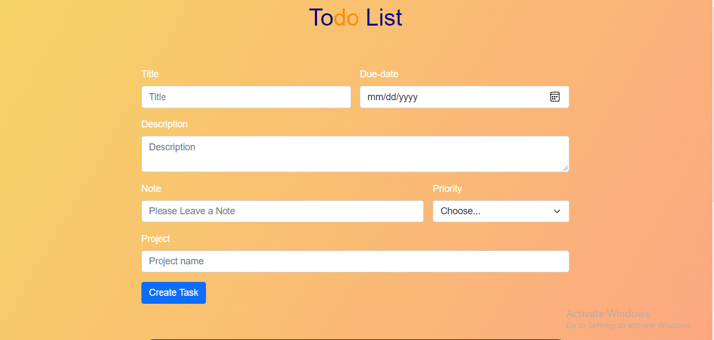

## Project: Todo

## Features

- Lets users manage activities/projects with todos
- Todos are persisted using local storage

## Built With

- Javascript (ES6)
- HTML5
- CSS3

## Live Demo

Visit [Todo](https://priceless-neumann-7ea644.netlify.app/)

## Prerequisites

- Internet browser compatible with HTML5, CSS3 and Javascript ES6

## Getting Started

- Clone the repository
- Navigate to the root directory of the project
- Open index.html or run it using your own live server

### Usage

From within the project directory after installing the required dependencies with `npm i` run  `npm start` to open the dev server to use the project locally.

## Author

👤 &nbsp; **Chukwuma Obasi**

- GitHub: [@ccobasi](https://github.com/ccobasi)
- Twitter: [@obasichux](https://twitter.com/obasichux)
- LinkedIn: [Chukwuma Obasi](https://www.linkedin.com/in/chukwuma-obasi/)

## Show your support

Give a ⭐️ if you like this project!

## Acknowledgments

This project was based on [The Odin Project](https://www.theodinproject.com/paths/full-stack-javascript/courses/javascript/lessons/todo-list) lesson

